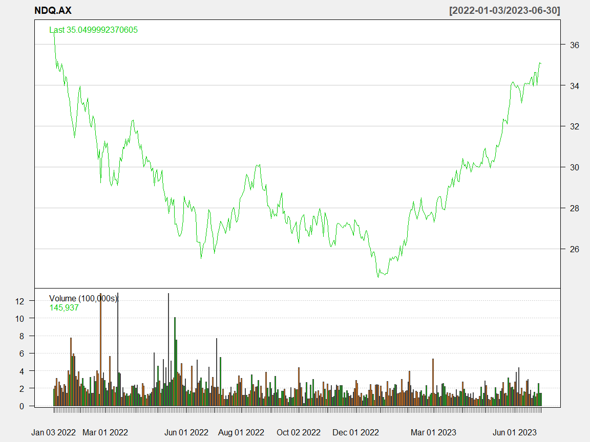
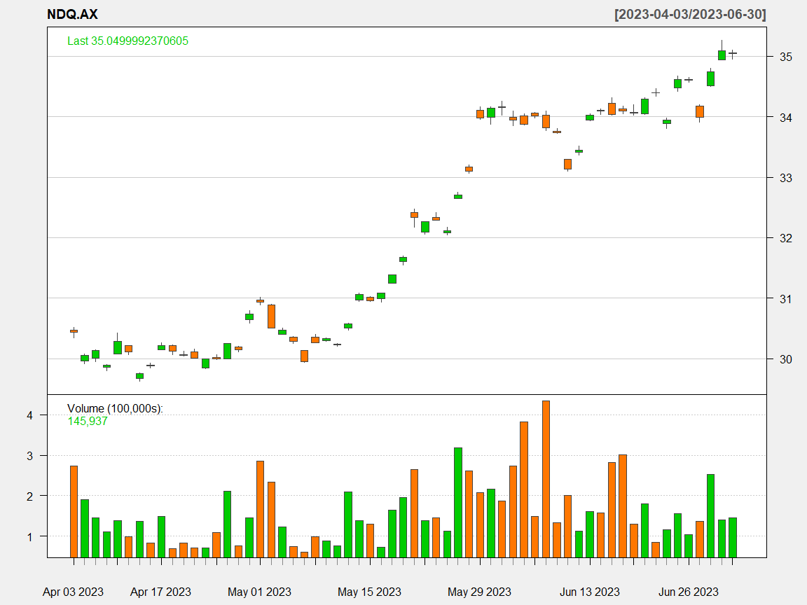
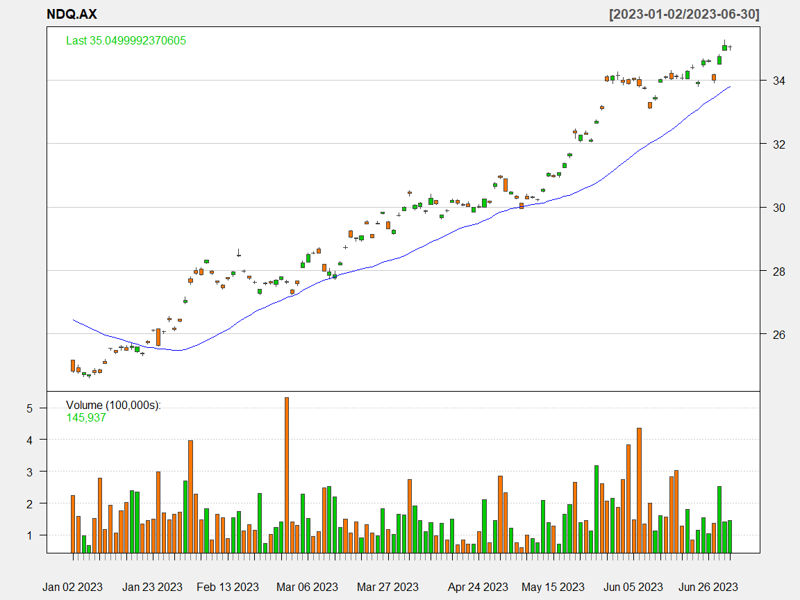
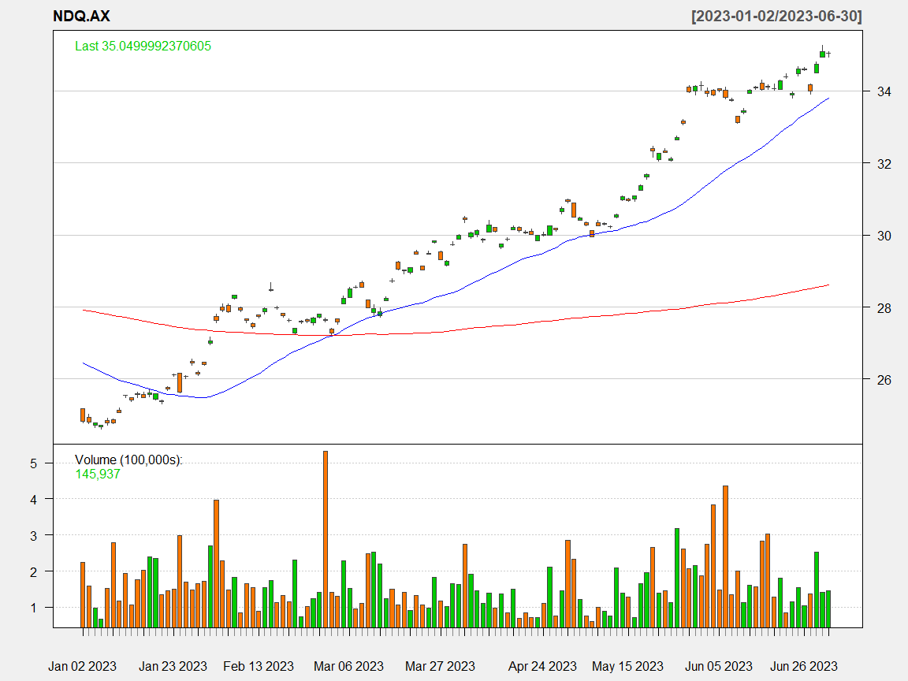
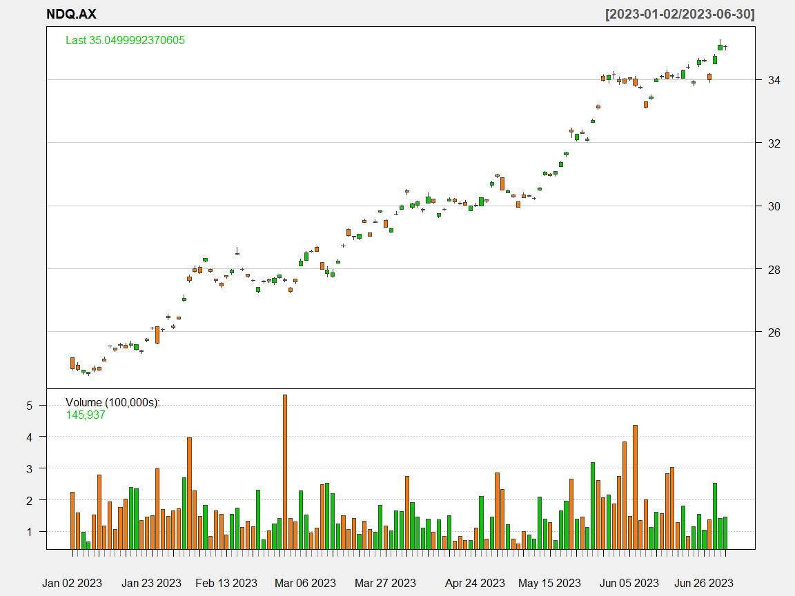
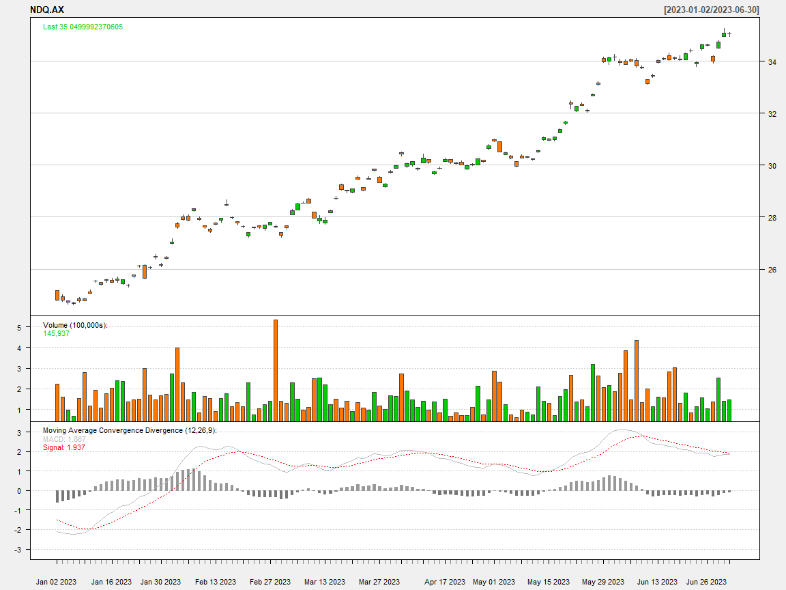
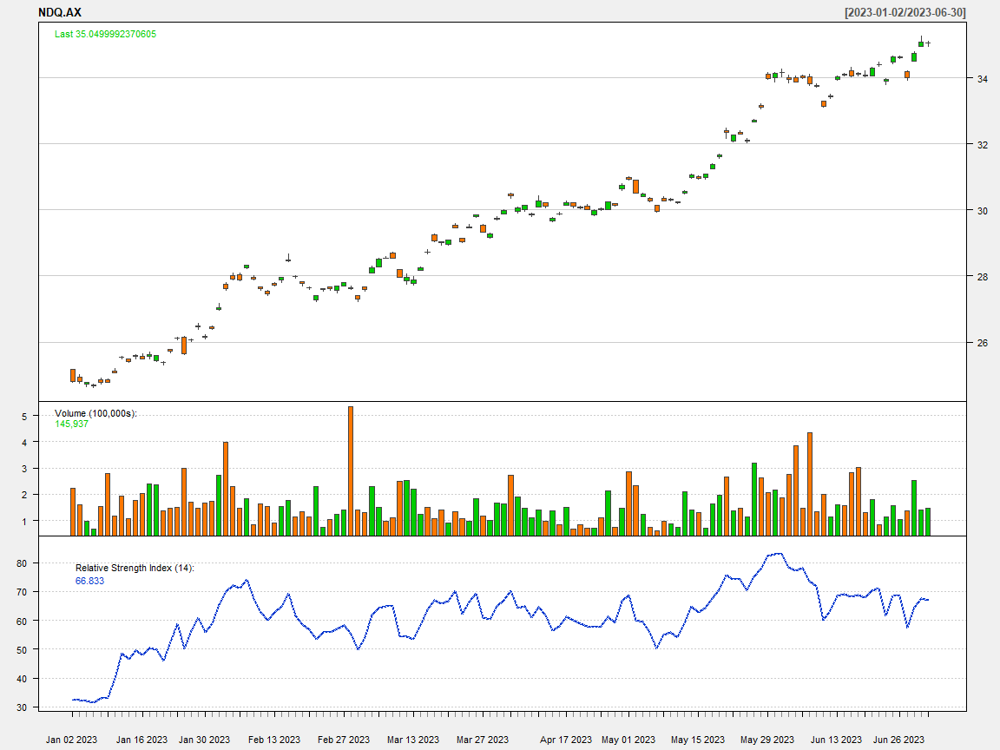
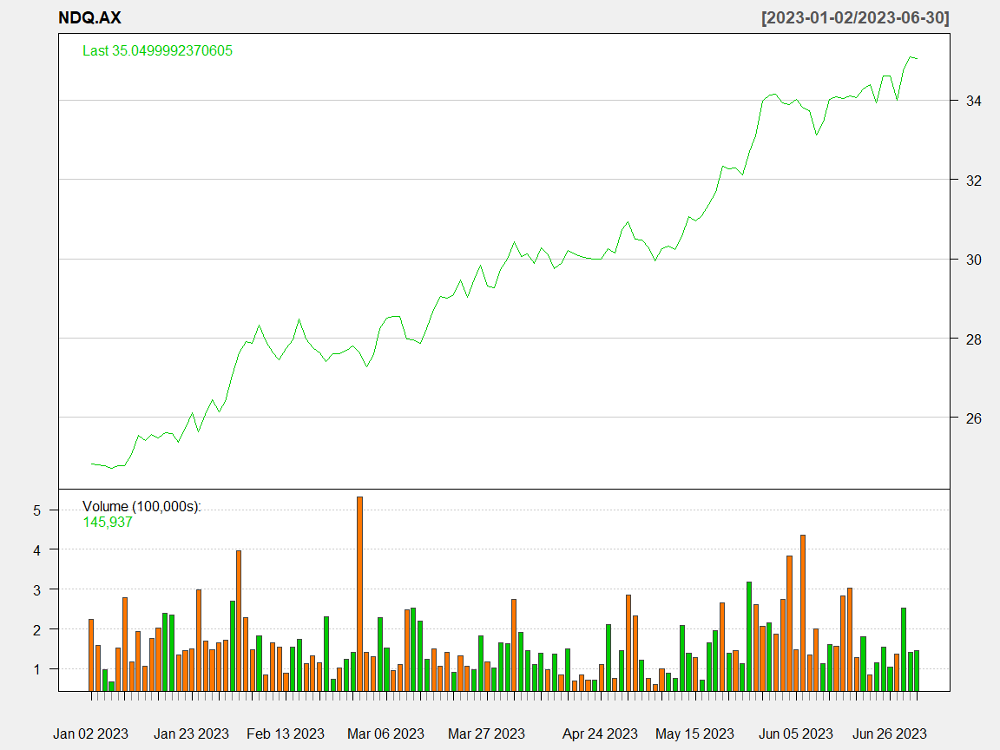
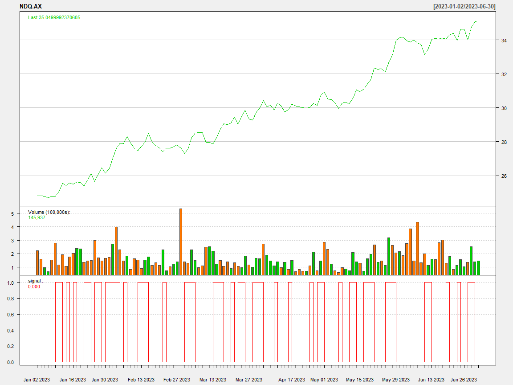

Technical Analysis Basics
================
*Carson Young*

July 2023

## Technical Analysis Introduction

The motivation behind technical analysis is to predict price movements
by scrutinising historical data. Charting and several technical
indicators such as Moving average convergence/divergence (MACD) and
Relative Strength Index (RSI) are discussed.

## Data Collection

We shall use my favourite index fund- NASDAQ 100.

``` r
getSymbols("NDQ.AX",from = as.Date("2017-01-01"), to = as.Date("2023-06-30"))
```

    ## [1] "NDQ.AX"

``` r
head(NDQ.AX)
```

    ##            NDQ.AX.Open NDQ.AX.High NDQ.AX.Low NDQ.AX.Close NDQ.AX.Volume
    ## 2017-01-02       11.73       11.73      11.70        11.70          5401
    ## 2017-01-03       11.79       11.79      11.78        11.79         12651
    ## 2017-01-04       11.75       11.75      11.71        11.71          8355
    ## 2017-01-05       11.70       11.75      11.70        11.75          3770
    ## 2017-01-08       11.80       11.88      11.80        11.87         37734
    ## 2017-01-09       11.82       11.85      11.76        11.76         17175
    ##            NDQ.AX.Adjusted
    ## 2017-01-02           11.70
    ## 2017-01-03           11.79
    ## 2017-01-04           11.71
    ## 2017-01-05           11.75
    ## 2017-01-08           11.87
    ## 2017-01-09           11.76

## Charting

``` r
chartSeries(NDQ.AX,
            type="line",
            subset='2022::2023',
            theme=chartTheme('white'))
```

<!-- -->

``` r
chartSeries(NDQ.AX,
            type="candlesticks",
            subset='2023-04::2023-06',
            theme=chartTheme('white'))
```

<!-- --> \##
Simple Moving Average

A moving average of order $m$ can be written as

$$\hat{T_t} = \frac{1}{m}  \sum_{j = -k}^{k} y_{t+j} $$

where $m = 2k + 1$

The estimate of the trend-cycle at time $t$ is obtained by averaging
values of the time series within $k$ periods of $t$. Observations that
are nearby in time are also likely to be close in value. Therefore, the
average eliminates some of the randomness in the data, leaving a smooth
trend-cycle component, denoted by $m-\textbf{MA}$(moving avg of order
$m$).

We use a 20 day SMA and a 200 day SMA.

``` r
chartSeries(NDQ.AX,
            subset='2023-01::2023-07',
            theme=chartTheme('white'))
```

<!-- -->

``` r
addSMA(n=30,on=1,col = "blue")
```

<!-- -->

``` r
addSMA(n=200,on=1,col = "red")
```

<!-- --> \##
Moving average convergence/divergence (MACD)

``` r
chartSeries(NDQ.AX,
            subset='2023-01::2023-07',
            theme=chartTheme('white'))
```

<!-- -->

``` r
addMACD(fast=12,slow=26,signal=9,type="EMA")
```

<!-- -->

## Relative Strength Index (RSI)

Traditionally, RSI readings greater than the 70 level are considered to
be in overbought territory, and RSI readings lower than the 30 level are
considered to be in oversold territory.

``` r
chartSeries(NDQ.AX,
            subset='2023-01::2023-07',
            theme=chartTheme('white'))
```

<!-- -->

``` r
addRSI(n=14,maType="EMA")
```

<!-- -->

# Simple trading strategy- Simple buy

We buy if the price increase is compared to previous day exceeds a
threshold $\delta$

$$\text{Buy}:\frac{P_t}{P_{t-1}}>1+\delta$$
$$\text{signal}= \begin{cases}
0 &\text{if not buy},   \\
1 &\text{if buy}.   \end{cases}$$

``` r
price <- Cl(NDQ.AX) # close price
r <- price/Lag(price) - 1 # % price change
delta <-0.005 #threshold
signal <-c(0) # first date has no signal

#Loop over all trading days (except the first)
for (i in 2: length(price)){
  if (r[i] > delta){
    signal[i]<- 1
  } else
    signal[i]<- 0
}

signal<-reclass(signal,price)
```

``` r
# Charting with Trading rule
chartSeries(NDQ.AX,
            type = 'line',
            subset='2023-01::2023-07',
            theme=chartTheme('white'))
```

<!-- -->

``` r
addTA(signal,type='S',col='red')
```

<!-- -->
